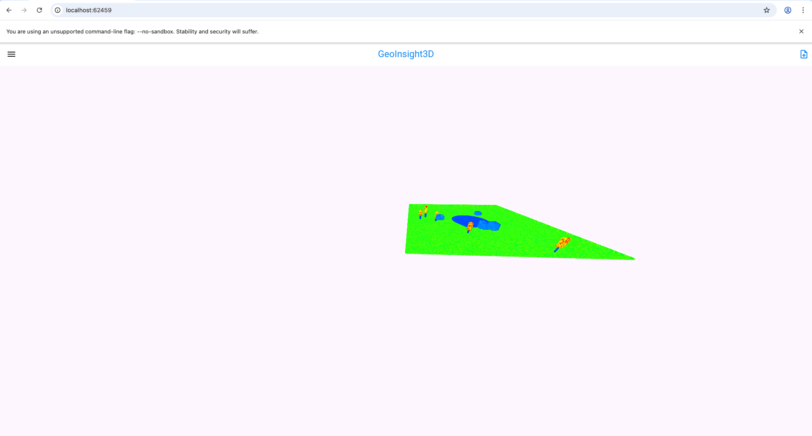
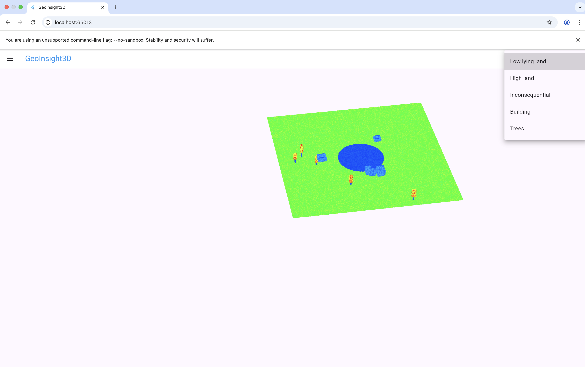
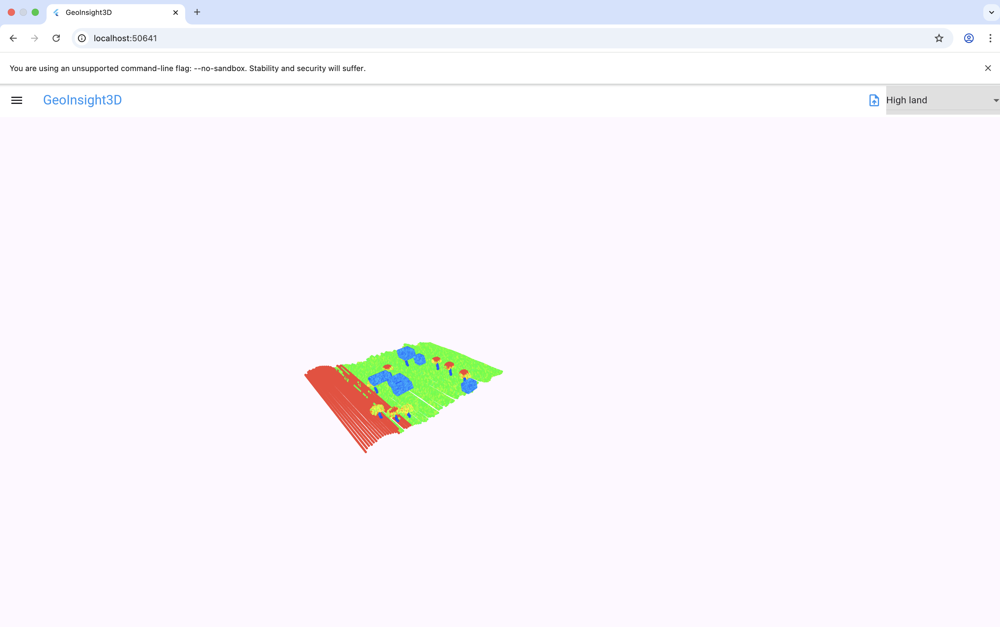

# GeoInsight3D
Description:
    A 3D visualiser where a csv file is uploaded, analysis is performed on the csv file, and the file and analysis is visualised.

Inspiration:
    Neara's 3D infrastructure visualisation efforts.

### CSV Format:
CSV files must be in the typical LIDAR format of:
X,Y,Z,Intensity

With values similar to 
```
12.54,33.27,5.12,120
12.55,33.28,5.10,118
12.60,33.35,8.10,110
12.80,33.41,15.20,65
12.82,33.43,15.25,60
12.90,33.45,30.50,10
12.91,33.47,30.45,12
```
### Use:
run:
```
make run
```
This runs the server and frontend. A web application will open with a image like 

You can then rotate the lidar scan with your mouse's scroll feature, or drag. You can also select classes to highlight on the screen. Like so:

The result will be something akin to:



